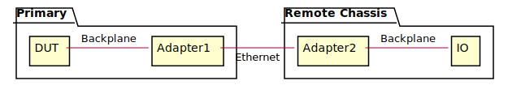

# References
- [The Repository](https://github.com/sirtyman/design_templates/new/master)
- [ATP](https://a_link_to_ATP.com)

# User Applications
- Application X
- Application Y
- Application Z

# Test Bed diagram

<div hidden>

```
@startuml required_equipment

skinparam componentStyle rectangle

package "Chassis1" {
  [DUT] - [Adapter1]: Backplane
}

package "Remote Chassis" {
[Adapter1] - [Adapter2]: Ethernet
[Adapter2] - [IO]: Backplane
}

@enduml
```

</div>




# The goal
The goal for the test designs included in this test scenario is
to verify connection integrity...


# Test Scenarios

## **test_connection_integrity.scenario_1**
### Preconditions
- DUT is in the X state
- Application X downloaded to DUT
- Task A is inhibited
- All connections with external devices are set
- All connections are not flickering over 20 s

### Steps
- **Given** DUT connected to the Ethernet
And connection rate set to the highest rate
- **When** un-inhibiting task
And when waiting TEST_WAIT time [s]
- **Then** All connections are preserved during the TEST_WAIT time
And data integrity is preserved during the TEST_WAIT time

### Postconditions
- Blanc the DUT


## **test_connection_integrity.scenario_2**
### Preconditions
- DUT is in the Y state
- Application Y downloaded to DUT
- Task B is inhibited
- All connections with external devices are set
- All connections are not flickering over 20 s

### Steps
- **Given** DUT connected to the Ethernet
And connection rate set to the highest rate
- **When** un-inhibiting task
And when waiting TEST_WAIT time [s]
- **Then** All connections are preserved during the TEST_WAIT time
And data integrity is preserved during the TEST_WAIT time

### Postconditions
- Blanc the DUT
